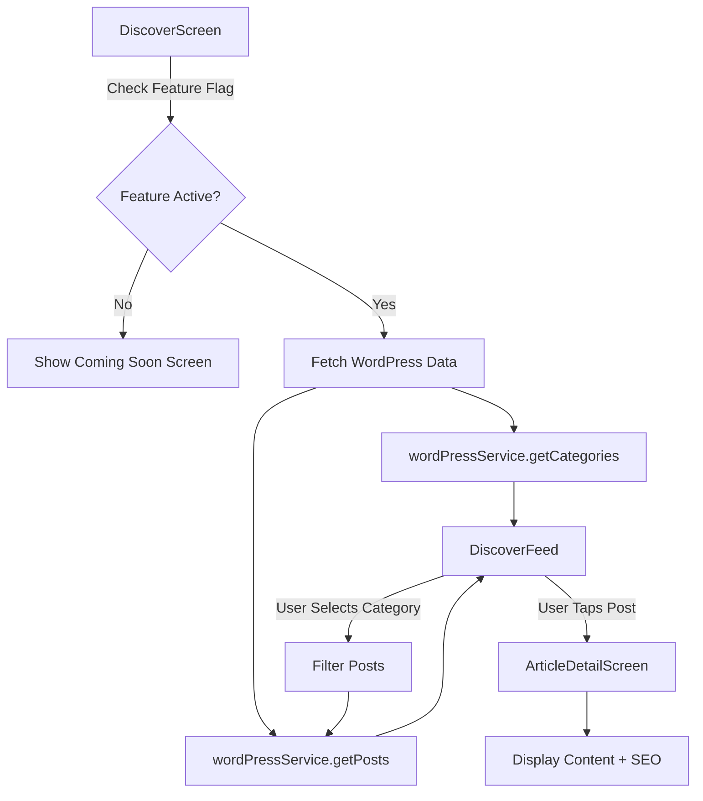

# WordPress Headless CMS Integration

## Overview

VTradingAPP integrates with a WordPress headless CMS (`discover.vtrading.app`) to provide dynamic content for the Discovery feature. This integration supports categories, tags, Yoast SEO metadata, and embedded author/media data.

## Architecture

### Components

1. **WordPressService** (`src/services/WordPressService.ts`)

   - Handles all WordPress REST API interactions
   - Provides methods for fetching posts, categories, and tags
   - Formats WordPress data for app consumption
   - Implements caching and error handling

2. **DiscoverScreen** (`src/screens/DiscoverScreen.tsx`)

   - Main screen for Discovery feature
   - Checks `discover` feature flag before loading content
   - Fetches WordPress categories and posts
   - Implements category filtering

3. **DiscoverFeed** (`src/components/discover/DiscoverFeed.tsx`)

   - Displays WordPress posts in a feed layout
   - Shows category chips for filtering
   - Handles pagination and loading states

4. **ArticleDetailScreen** (`src/screens/ArticleDetailScreen.tsx`)
   - Displays full article content
   - Shows WordPress tags and categories
   - Displays Yoast SEO metadata
   - Renders HTML content via WebView

## WordPress REST API Endpoints

### Base URL

```
https://discover.vtrading.app/wp-json/wp/v2
```

### Endpoints Used

| Endpoint           | Method | Description                       |
| ------------------ | ------ | --------------------------------- |
| `/posts`           | GET    | Fetch posts with optional filters |
| `/posts/{id}`      | GET    | Fetch single post by ID           |
| `/categories`      | GET    | Fetch all categories              |
| `/categories/{id}` | GET    | Fetch single category             |
| `/tags`            | GET    | Fetch all tags                    |
| `/tags/{id}`       | GET    | Fetch single tag                  |

### Query Parameters

#### Posts Endpoint

- `page`: Page number (default: 1)
- `per_page`: Posts per page (default: 10)
- `_embed`: Include embedded data (author, media, terms)
- `categories`: Filter by category ID
- `tags`: Filter by tag ID
- `search`: Search posts by keyword

#### Categories/Tags Endpoints

- `per_page`: Items per page (default: 100)
- `orderby`: Sort by field (e.g., 'count', 'name')
- `order`: Sort order ('asc' or 'desc')

## Feature Flag Integration

The Discovery feature is controlled by the `discover` feature flag in Firebase Remote Config.

### Configuration

```json
{
  "feature_flags": {
    "features": [
      {
        "name": "discover",
        "enabled": true,
        "rules": []
      }
    ]
  }
}
```

### Usage in Code

```typescript
// In DiscoverScreen.tsx
const isFeatureActive = await remoteConfigService.getFeature('discover');

if (isFeatureActive) {
  // Fetch WordPress content
  const [categories, posts] = await Promise.all([
    wordPressService.getCategories(),
    wordPressService.getPosts(),
  ]);
}
```

When the feature flag is disabled, users see a "coming soon" screen instead of WordPress content.

## Data Flow



## Embedded Data (`_embed` Parameter)

The `_embed=true` parameter includes related data in the API response:

### Author Data

```typescript
_embedded.author[0] = {
  id: number,
  name: string,
  avatar_urls: { '96': string },
  description: string,
};
```

### Featured Media

```typescript
_embedded['wp:featuredmedia'][0] = {
  id: number,
  source_url: string,
  alt_text: string,
};
```

### Categories & Tags

```typescript
_embedded['wp:term'][0] = [
  /* categories */
];
_embedded['wp:term'][1] = [
  /* tags */
];
```

## Yoast SEO Integration

Yoast SEO metadata is available in the `yoast_head_json` field:

```typescript
yoast_head_json = {
  title: string,
  description: string,
  canonical: string,
  og_title: string,
  og_description: string,
  og_image: [{ url: string }],
  twitter_card: string,
};
```

### Display in ArticleDetailScreen

```tsx
{
  article.seoDescription && (
    <Surface style={styles.seoBox}>
      <Text>RESUMEN SEO</Text>
      <Text>{article.seoDescription}</Text>
      {article.yoastSEO?.canonical && (
        <Text>Fuente: {article.yoastSEO.canonical}</Text>
      )}
    </Surface>
  );
}
```

## Caching Strategy

### Cache TTL

| Resource    | TTL        | Reason                     |
| ----------- | ---------- | -------------------------- |
| Posts       | 5 minutes  | Frequently updated content |
| Single Post | 10 minutes | Less frequently accessed   |
| Categories  | 30 minutes | Rarely change              |
| Tags        | 30 minutes | Rarely change              |

### Implementation

```typescript
const posts = await this.client.get<WordPressPost[]>('posts', {
  params: { _embed: true },
  useCache: true,
  cacheTTL: 5 * 60 * 1000, // 5 minutes
});
```

Cache is managed by `ApiClient` service.

## Error Handling

All WordPress service methods implement graceful error handling:

```typescript
try {
  const posts = await this.client.get<WordPressPost[]>('posts', {...});
  return posts.map(this.formatPost);
} catch (error) {
  observabilityService.captureError(error, {
    context: 'WordPressService.getPosts'
  });
  return []; // Return empty array instead of throwing
}
```

### User-Facing Errors

```typescript
// In DiscoverScreen.tsx
try {
  const posts = await wordPressService.getPosts(1, 10, categoryId);
  setPosts(posts);
} catch (err) {
  observabilityService.captureError(err);
  showToast('Error al filtrar por categoría', 'error');
}
```

## Usage Examples

### Fetch All Posts

```typescript
import { wordPressService } from '../services/WordPressService';

const posts = await wordPressService.getPosts();
```

### Fetch Posts by Category

```typescript
const cryptoPosts = await wordPressService.getPosts(1, 10, categoryId);
```

### Fetch Categories

```typescript
const categories = await wordPressService.getCategories();
```

### Search Posts

```typescript
const results = await wordPressService.searchPosts('bitcoin');
```

### Fetch Single Post

```typescript
const post = await wordPressService.getPostById(123);
```

## Testing

Unit tests are located in `__tests__/services/WordPressService.test.ts`.

### Running Tests

```bash
npm test -- WordPressService.test.ts
```

### Test Coverage

- ✅ Fetch posts with embedded data
- ✅ Filter posts by category
- ✅ Filter posts by tag
- ✅ Fetch categories and tags
- ✅ Search posts
- ✅ Error handling
- ✅ Post formatting
- ✅ Read time calculation

## WordPress Requirements

### Required Plugins

1. **Yoast SEO** - For SEO metadata in `yoast_head_json`
2. **Jetpack** (Optional) - For `jetpack_featured_media_url` fallback

### WordPress Configuration

Ensure the following are enabled:

- ✅ WordPress REST API v2
- ✅ Public access to posts, categories, and tags
- ✅ Yoast SEO plugin installed and active
- ✅ Featured images enabled for posts

### CORS Configuration

If accessing from React Native, ensure CORS headers are configured:

```php
// In WordPress functions.php or plugin
add_action('rest_api_init', function() {
  remove_filter('rest_pre_serve_request', 'rest_send_cors_headers');
  add_filter('rest_pre_serve_request', function($value) {
    header('Access-Control-Allow-Origin: *');
    header('Access-Control-Allow-Methods: GET, POST, OPTIONS');
    header('Access-Control-Allow-Credentials: true');
    return $value;
  });
});
```

## Troubleshooting

### Issue: Posts not loading

**Possible Causes:**

1. Feature flag disabled
2. Network error
3. WordPress API unavailable

**Solution:**

```typescript
// Check feature flag
const isActive = await remoteConfigService.getFeature('discover');
console.log('Discovery feature active:', isActive);

// Check API response
const posts = await wordPressService.getPosts();
console.log('Fetched posts:', posts.length);
```

### Issue: Categories not showing

**Possible Causes:**

1. No categories created in WordPress
2. API error

**Solution:**

```typescript
const categories = await wordPressService.getCategories();
console.log('Categories:', categories);
```

### Issue: Yoast SEO metadata missing

**Possible Causes:**

1. Yoast SEO plugin not installed
2. Plugin not activated
3. SEO data not configured for post

**Solution:**

- Install and activate Yoast SEO plugin in WordPress
- Configure SEO metadata for posts in WordPress admin

### Issue: Featured images not displaying

**Possible Causes:**

1. `_embed` parameter not included
2. Featured image not set in WordPress
3. Image URL inaccessible

**Solution:**

```typescript
// Check if _embed is enabled
const posts = await wordPressService.getPosts();
console.log('Featured image:', posts[0]?.image);

// Fallback to placeholder
const image =
  post._embedded?.['wp:featuredmedia']?.[0]?.source_url ||
  'https://via.placeholder.com/150';
```

## Performance Considerations

### Optimization Tips

1. **Use Pagination**: Don't fetch all posts at once

   ```typescript
   const posts = await wordPressService.getPosts(1, 10); // Page 1, 10 items
   ```

2. **Cache Aggressively**: Categories and tags rarely change

   ```typescript
   cacheTTL: 30 * 60 * 1000; // 30 minutes for categories
   ```

3. **Filter on Server**: Use WordPress API filters instead of client-side filtering

   ```typescript
   const posts = await wordPressService.getPosts(1, 10, categoryId);
   ```

4. **Lazy Load Images**: Use React Native's Image component with lazy loading

5. **Implement Infinite Scroll**: Load more posts as user scrolls
   ```typescript
   onEndReached={() => {
     const nextPage = currentPage + 1;
     loadMorePosts(nextPage);
   }}
   ```

## Future Enhancements

- [ ] Add support for custom post types
- [ ] Implement post bookmarking
- [ ] Add comment fetching and posting
- [ ] Support for WordPress custom fields
- [ ] Offline support with local database
- [ ] Push notifications for new posts
- [ ] Advanced search with filters
- [ ] Related posts recommendations
